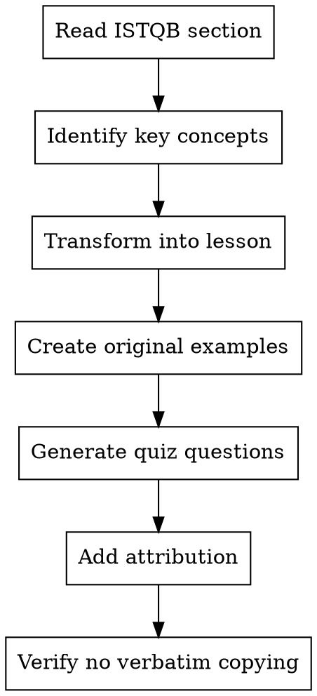

# ISTQB Content Workflow

## Overview

**Critical Rule:** ISTQB syllabus content is copyrighted. You MUST transform it into original educational content, not copy it.

**Core Principle:** Like a teacher adapting a textbook—you reference the source, teach the concepts in your own way, and create original practice materials.

## When to Use

**Triggers:**
- Creating lesson content from ISTQB syllabus
- Transforming syllabus sections into articles
- Creating quiz questions based on learning objectives
- Working with any ISTQB-sourced material
- Unsure about copyright boundaries

## Legal Boundaries (CRITICAL)

### What ISTQB Copyright Allows

From ISTQB syllabus copyright notice:

✅ **Permitted:**
- Extracts for non-commercial use (with source acknowledged)
- Using syllabus as basis for training courses (after accreditation)
- Using syllabus as basis for articles and books (with acknowledgment)
- Quoting specific definitions with attribution

❌ **Prohibited:**
- Copying entire sections verbatim
- Using syllabus content without acknowledgment
- Commercial use without accreditation
- Claiming ISTQB content as your own

### Attribution Requirements

**MANDATORY on every lesson derived from ISTQB content:**

```markdown
> **Source:** This lesson is based on the ISTQB® Certified Tester Foundation Level Syllabus v4.0.1
> © International Software Testing Qualifications Board

```

**Reference format in explanations:**

```markdown
According to the ISTQB syllabus (section 1.1.1), a test objective is...
```

## Transformation Workflow



### Step 1: Read ISTQB Section

**Access markdown files directly:**

```bash
# Syllabus is already converted to markdown
cat docs/istqb/CTFL_V4/ISTQB_CTFL_Syllabus_v4.0.1.md
```

**Extract:**
- Learning Objectives (LO codes like FL-1.1.1)
- K-Levels (K1, K2, K3)
- Key terminology and definitions
- Core concepts and principles

### Step 2: Transform Content (NOT Copy-Paste)

**BAD (Copyright Violation):**

```markdown
<!-- Copied verbatim from syllabus -->
## Test Objectives

Typical test objectives are:
- Evaluating work products such as requirements, user stories, designs, and code
- Triggering failures and finding defects
- Ensuring required coverage of a test object
```

**GOOD (Transformed):**

```markdown
## Why Do We Test? Understanding Test Objectives

When you start a testing project, the first question should be: *What am I trying to achieve?*

Test objectives define your testing goals. Common objectives include:

**1. Evaluating Quality Before It's Too Late**
Catch issues in requirements, designs, and code *before* they become expensive bugs in production.

**2. Finding Defects Through Deliberate Failure**
Your job isn't to prove the software works—it's to make it fail in controlled ways to reveal hidden defects.

**3. Measuring Coverage**
Ensure you've tested what matters. Coverage metrics tell you if critical areas were examined.

> **Source:** Based on ISTQB® CTFL Syllabus v4.0.1, section 1.1.1
> © International Software Testing Qualifications Board
```

### Step 3: Create Original Examples

**Requirement:** Examples MUST be original, not from syllabus.

**Approach:**
- Real-world scenarios (e-commerce, healthcare, finance)
- Modern tools and technologies (not dated examples)
- Relatable situations users will encounter

**Example:**

```markdown
## Example: Test Objective in Action

**Scenario:** You're testing a payment gateway integration for an e-commerce site.

**Test Objective:** Verify compliance with PCI-DSS security requirements.

**Why This Matters:**
- Legal requirement (compliance)
- Business risk (fines, reputation)
- User trust (security)

This demonstrates how test objectives tie directly to business and regulatory needs.
```

### Step 4: Generate Quiz Questions

**CRITICAL:** Never copy sample exam questions. Create original questions *inspired* by ISTQB samples.

**Process:**

1. **Read:** Study ISTQB sample exams to understand question style
2. **Identify:** Extract the Learning Objective being tested
3. **Create:** Write an original question testing the same LO
4. **Differentiate:** Use different scenario, wording, and distractors

**See:** `.claude/skills/create-quiz-questions.md` for detailed standards.

**Example Transformation:**

```typescript
// ❌ BAD: Copied from ISTQB sample exam
{
  question: "Which of the following statements describe a valid test objective?",
  options: [
    "To prove that there are no unfixed defects",
    "To reduce the risk level of the test object", // Copied verbatim
    "To prove there will be no failures after implementation",
    "To verify that there are no untested combinations"
  ]
}

// ✅ GOOD: Original question testing same LO (FL-1.1.1)
{
  question: "A testing team is planning their approach for a new mobile app. Which objective should guide their test strategy?",
  options: [
    {
      id: "a",
      text: "Identifying potential defects before users encounter them",
      isCorrect: true
    },
    {
      id: "b",
      text: "Proving the app is completely bug-free",
      isCorrect: false
    },
    {
      id: "c",
      text: "Reducing development time for new features",
      isCorrect: false
    },
    {
      id: "d",
      text: "Eliminating the need for user acceptance testing",
      isCorrect: false
    }
  ],
  explanation: {
    correct: "According to ISTQB (section 1.1.1), a key test objective is finding defects before release. Testing cannot prove absence of defects, but it can reveal their presence.",
    incorrect: {
      b: "Testing cannot prove software is bug-free—this violates a core testing principle.",
      c: "Development speed is not a test objective; testing focuses on quality, not velocity.",
      d: "Testing complements, not replaces, UAT. Different test levels serve different purposes."
    }
  },
  learningObjective: "FL-1.1.1",
  kLevel: "K2"
}
```

### Step 5: Add Attribution

**Every lesson MUST include:**

```markdown
---
title: "Fundamentals of Testing"
istqb_chapter: "1"
istqb_section: "1.1"
---

# [Lesson Content]

[Your transformed content here]

---

## References

> **Source:** This lesson is based on the ISTQB® Certified Tester Foundation Level Syllabus v4.0.1
> © International Software Testing Qualifications Board
>
> [Learn more about ISTQB certification](https://www.istqb.org)
```

### Step 6: Verification Checklist

Before committing any ISTQB-derived content:

- [ ] **No verbatim copying** of syllabus paragraphs
- [ ] **Attribution present** at top or bottom of lesson
- [ ] **Examples are original** (not from syllabus)
- [ ] **Quiz questions are original** (not from sample exams)
- [ ] **Learning Objectives referenced** in quiz metadata
- [ ] **Syllabus sections cited** in explanations
- [ ] **Terminology matches ISTQB** (e.g., "test object" not "thing being tested")
- [ ] **Content teaches**, not just summarizes

## Integration with Existing Skills

### PDF Conversion

**If PDF found:** Use `.claude/skills/pdf-to-markdown.md`

```bash
pnpm convert:pdf docs/istqb
```

**Always convert PDFs to markdown immediately.** Markdown is the working format.

### Quiz Creation

**When creating questions:** Use `.claude/skills/create-quiz-questions.md`

**Key Integration Points:**
- K-Level alignment (K1/K2/K3)
- Distractor quality (plausible, educational)
- Explanation format (syllabus references)
- ISTQB terminology exactness

## Common Mistakes

### ❌ Mistake 1: Copy-Paste Content

```markdown
<!-- Copied directly from syllabus -->
Testing is a process which includes test planning, test design, test execution...
```

**Why Wrong:** Copyright violation. ISTQB content is protected.

**Fix:** Rephrase in your own words, teaching the concept differently.

### ❌ Mistake 2: No Attribution

```markdown
## Test Objectives

[Content derived from syllabus but no attribution]
```

**Why Wrong:** ISTQB requires acknowledgment for extracts.

**Fix:** Add source acknowledgment.

### ❌ Mistake 3: Copying Sample Exam Questions

```markdown
// Using ISTQB sample exam question verbatim
```

**Why Wrong:** Sample exams are copyrighted. Creating original questions tests same understanding.

**Fix:** Write original question testing same Learning Objective.

### ❌ Mistake 4: Shallow Transformation

```markdown
<!-- Just replaced a few words -->
Usual test goals are: checking work products like requirements...
```

**Why Wrong:** This is still derivative copying, not transformation.

**Fix:** Teach the concept in a completely different way (examples, analogies, modern context).

## Fair Use Guidance

### What Counts as "Fair Use"

✅ **Likely Fair Use:**
- Short quotes (1-2 sentences) with attribution
- Definitions of key terms (with citation)
- References to Learning Objectives
- Paraphrased explanations of concepts

❌ **NOT Fair Use:**
- Entire sections copied verbatim
- Multiple consecutive paragraphs
- Sample exam questions copied directly
- Syllabus structure replicated exactly without transformation

### The "Teacher Test"

**Ask yourself:** *Would a teacher write a textbook by copying another textbook?*

No. They:
1. Read the source material
2. Understand the concepts
3. Teach those concepts in their own way
4. Create original examples and exercises
5. Cite the source material when quoting

**Do the same.**

## Red Flags - STOP and Review

If you're about to:
- Copy more than 2 consecutive sentences from syllabus
- Use sample exam questions without transformation
- Create content without attribution
- Replicate syllabus structure exactly
- Think "I'll just tweak a few words"

**STOP. You're likely violating copyright.**

## Real-World Impact

**Legal Risk:**
- ISTQB can issue DMCA takedown notices
- Copyright infringement claims
- Platform removal (GitHub, hosting)

**Ethical Risk:**
- Disrespecting intellectual property
- Undermining trust with users
- Violating professional standards

**Pedagogical Risk:**
- Copy-paste content is poor teaching
- Users need transformation to learn effectively
- Original examples are more engaging

## Bottom Line

**Transformation isn't optional—it's mandatory.**

You're creating a course *inspired* by ISTQB, not *duplicating* ISTQB.

**The goal:** Teach the concepts better than the syllabus does, while respecting the source material.
